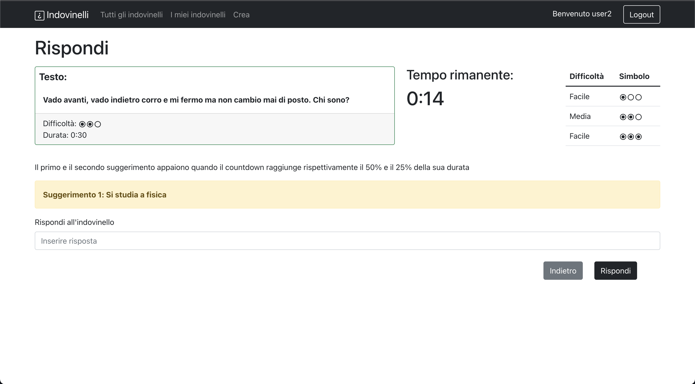

# Exam #2: "Indovinelli"
## Student: s296273 D'Amico Lorenzo 

## React Client Application Routes

- Route `/`: Rimanda direttamente a `/tutti`
- Route `/tutti`: Contiene: 
  - Tutti gli indovinelli, divisi tra aperti e chiusi.
  - La classifica
  - Una legenda per il livello di difficoltà

  E' visibile sia a utenti anonimi che agli utenti registrati, tuttavia questi ultimi hanno dei pulsanti per accedere ai dettagli degli indovinelli o per rispondervi.
- Route `/login`: Contiene il form per il login, serve per eseguire l'accesso. Se l'accesso non va a buon fine è mostrato un messaggio di errore.
- Route `/crea`: Contiene un form per creare un indovinello. Dei controlli vengono fatti sui campi inseriti. Se tutti i controlli passano, alla pressione del tasto "crea", un indovinello viene creato e l'utente è reindirizzato alla homepage dopo la creazione.
- Route `/indovinelli/:id`: Contiene le informazioni relative a un indovinello. Il contenuto cambia se l'indovinello è chiuso o aperto. Se è aperto inoltre cambia se l'indovinello è il mio oppure quello di un altro user:
  - Chiuso: Contiene la legenda della difficoltà, le informazioni dell'indovinello, l'indicazione del vincitore se presente, la risposta giusta e la lista delle risposte date.
  - Aperto mio: Contiene la legenda delle difficoltà, le informazioni dell'indovinello, il tempo rimanente e le risposte date aggiornate ogni secondo.
  - Aperto altro user: Contiene la legenda della difficoltà, le informazioni dell'indovinello, e il tempo rimanente. Contiene inoltre un form per rispondere all'indovinello ed eventuali suggerimenti. Se si ha già risposto allora il apparirà un messaggio di avviso al posto del form.

  Il parametro :id è l'id del particolare indovinello scelto.
- Route `/miei`: E' come `/tutti`, ma contiene solamente gli indovinelli dello user loggato in quel momento.

## API Server

- GET `/api/indovinelli`
  - request body vuoto
  - [200 OK] Il response body contiene la lista di tutti gli indovinelli, comprendenti per ognuno le informazioni necessarie.\
  [
  { 
    "id": 1,\
    "domanda": "Testo della domanda",\
    "difficolta": "facile",\
    "stato": "aperto",\
    "durata": 30,\
    "autore": 1\
  }
  ]
  - [500 Internal Server Error] 
- POST `/api/indovinelli`
  - Il request body contiene i campi necessari a creare un indovinello:
  {
    "domanda": "Testo della domanda",\
    "risposta": "Testo della risposta",\
    "difficolta": "media",\
    "suggerimento1": "sugg1",\
    "suggerimento2": "sugg2",\
    "durata": 600
  }
  - [201 Created]response body vuoto
  - [500 Internal Server Error] {"error": "Database error during the creation"}
- GET `/api/indovinelliChiusi/:id`
  - :id è l'id dell'indovinello di cui si vogliono ottenere informazioni. Request body vuoto
  - [200 OK] Il response body contiene le informazioni relative a un indovinello chiuso
  {
		"domanda": "Testo della domanda",\
		"risposta": "risp",\
		"difficolta": "difficile",\
		"autore": 1,\
		"vincitore": 2,\
		"risposteUtenti": [{"testo": "risp", "idUser": 2}]\
	};
  - [422 Unprocessable Entity] {"errors": [{...}]}
  - [404 Not Found] {"error": Indovinello Not Found}
  - [409 Conflict] {"error": "Non puoi ottenere queste informazioni su un indovinello aperto"}
  - [500 Internal Server Error] {"error": "Internal server error"}
- GET `/api/indovinelli/:id/timer`
  - :id è l'id dell'indovinello di cui vogliamo ottenere info sul timer. Request body vuoto
  - [200 OK] Il response body contiene le informazioni relative al timer e i suggerimenti:
    - {"timerValue": "non inizializzato"}
    - {"timerValue": "scaduto"}
    - {"timerValue": 25, "suggerimento1": "sugg", "suggerimento2": ""}
  - [422 Unprocessable entity] [422 Unprocessable Entity] {"errors": [{...}]}
  - [404 Not Found] {"error": Indovinello Not Found}
  - [500 Internal server error] {"error": "Internal server error"}
- POST `/api/indovinelli/:id/risposta`
  - Il request body contiene la risposta dell'utente. :id è l'id dell'indovinello al quale si vuole rispondere
  {"risposta": "Testo della risposta"}
  - [201 Created] Il response body contiene l'esito, cioè se la risposta è giusta o sbagliata
  {"rispostaCorretta": "no"}
  oppure
  {"rispostaCorretta": "si}
  - [422 Unprocessable entity] [422 Unprocessable Entity] {"errors": [{...}]}
  - [404 Not Found] {"error": Indovinello Not Found}
  - [409 Conflict] { "error": "Indovinello chiuso" } oppure {"error": "L'utente ha già risposto a questo indovinello"}
  - [500 Internal server error] {"error": "Internal server error"}
- GET `/api/indovinelli/:id/risposte`
  - :id è l'id dell'indovinello di cui vogliamo ottenere le risposte. Request body vuoto
  - [200 OK] Response body contiene l'id utente e la risposta per l'indovinello con l'id specificato nella URL.
  [{"testo": "risposta1", "idUser": 1},{"testo": "risposta2", "idUser": 2}]
  - [404 Not Found] {"error": Indovinello Not Found}
  - [401 Unauthorized] {"error": "Unauthorized user"}
  - [500 Internal server error] {"error": "Internal server error"}
- GET `/api/classifica`
  - request body vuoto
  - [200 OK] Response body contiene tutti gli utenti che hanno i 3 migliori punteggi. In ordine di punteggio (decrescente) e, a parità di esso, in ordine alfabetico di username
  [{"username": "user1", "punti": 30},\
  {"username": "user2", "punti": 20},\
  {"username": "user3", "punti": 10}]
  - [500 Internal server error] {"error": "Internal server error"}
- GET `/api/indovinelli/:id/giaRisposto`
  - :id è l'id dell'indovinello di cui vogliamo sapere se l'utente ha già rispsoto. Request body vuoto
  - [200 OK] Il responso body contiene l'esito
  {"esito": false} oppure {"esito": true}
  - [404 Not Found] {"error": Indovinello Not Found}
  - [500 Internal server error] {"error": "Internal server error"}
- POST `/api/sessions`
  - Il request body contiene username e password\
  {"username": "user1", "password": "pass"}
  - [200 OK] Il response body contiene le informazioni dell'utente\
  {"id":1,"username":"user1"}
  - [401 Unauthorized]
- DELETE `/api/sessions/current`
  - Il request body è vuoto
  - [200 OK] Il responso body è vuoto
- GET `/api/sessions/current`
  - Il request body è vuoto
  - [200 OK] Il response body contiene le informazioni dell'utente\
  {"id":1,"username":"user1"}
  - [401 Unauthorized] {"error": "Unauthenticated user!"}

## Database Tables

CP = Chiave primaria\
CE = Chiave esterna

- Tabella `Indovinello` contiene id (CP), domanda, risposta, difficolta, durata, suggerimento1, suggerimento2, stato, scadenza, autore (CE User.id), vincitore (CE User.id)\
La tabella indovinello contiene tutte le informazioni riguardanti un indovinello, così come anche l'id dell'autore e del vincitore (se presente). scadenza rimane NULL finché l'indovinello è senza risposte. Viene valorizzato al timestamp attuale + durata quando viene creata la prima risposta.
- Tabella `User` contiene id (CP), username, hash, salt, punti\
Contiene le informazioni dell'utente. hash e salt sono presenti per non memorizzare in chiaro la password e sono usati per autenticare. La colonna punti serve a memorizzare quanti punti ha l'utente in quel momento.
- Tabella `Risposta` contiene idIndovinello (CE Indovinello.id), idUser (CE User.id), testo\
(idIndovinello e idUser sono insieme CP)\
Contiene il testo della risposta associato alla coppia idIndovinello e idUser che sono, insieme, chiave primaria.

## Main React Components
- `MyNavbar` (in `MyNavbar.js`): Componente per la visualizzazione della navbar, permette di muoversi nelle varie pagine dell'applicazione e di eseguire login e logout mediante un pulsante.
- `Classifica` (in `Homepage.js`): Componente che mostra la top 3 degli utenti con punteggi più alti e, a pari merito, tutti quelli con i 3 punteggi più alti.
- `BottoneIndovinello` (in `Homepage.js`) Bottone che mostra "Rispondi" o "Visualizza" rispettivamente se è un indovinello aperto di un altro user oppure se è chiuso/aperto dallo user corrente
- `Indovinello` (in `Homepage.js`): Componente per la visualizzazione delle informazioni di un indovinello, in particolare la domanda, la difficoltà e un `BottoneIndovinello` per la navigazione nel caso in cui un utente sia loggato.
- `ListaIndovinelli` (in `Homepage.js`): Componente per la visualizzazione di una lista di `Indovinello`
- `Homepage` (in `Homepage.js`): Componente che presenta la pagina che si visualizza quando si apre l'applicazione, contiene la classifica, la legenda per la difficoltà, la lista degli indovinelli separati tra aperti e chiusi.
- `FormCreazione` (in `FormCreazione.js`): Componente che presenta il form di creazione, e presenta un bottone "Crea" per richiedere al server di creare un indovinello. Dopo aver cliccato, se la validazione dei campi è andata a buon fine, viene mostrato un messaggio di attesa per attendere che l'indovinello venga creato. Dopo la creazione l'utente viene reindirizzato alla homepage.
- `Timer` (in `Timer.js`): Componente che mostra un timer nella forma minuti:secondi.
Ogni secondo fa una richiesta al server per ottenere il timer aggiornato. Il timer è fermo ed è pari alla durata se nessuno ha ancora risposto. 
- `LoginForm` (in `LoginComponents.js`): Componente che mostra il form di login. Permette di autenticarsi. Se l'autenticazione non va a buon fine viene mostrato un messaggio di errore.
- `IndovinelloAperto` (in `IndovinelloPages.js`): Componente che mostra le informazioni sull'indovinello, la legenda della difficoltà e il `Timer` di un indovinello aperto. Dipendentemente se l'indovinello è stato creato dallo user corrente, oppure da un altro user, vengono renderizzati rispettivamente `RisposteIndovinelloAperto` e `FormIndovinelloAperto`
- `RisposteIndovinelloAperto` (in `IndovinelloPages.js`): Componente che mostra le rispsoste date a un indovinello in tempo reale
- `FormIndovinelloAperto` (in `IndovinelloPages.js`) Componente che mostra un form per rispondere a un indovinello. Il form viene disabilitato nel caso l'indovinello diventi chiuso (tempo scaduto oppure un altro user risponde correttamente). Vengono mostrati i suggerimenti se il timer scende sotto il 50% e il 25%.
Viene mostrato l'esito della risposta nel caso in cui l'utente risponda. Se l'utente ha già risposto al posto del form appare un avviso.

## Screenshot

## Users Credentials

- user1, pass
- user2, pass 
- user3, pass 
- user4, pass 
- user5, pass 
